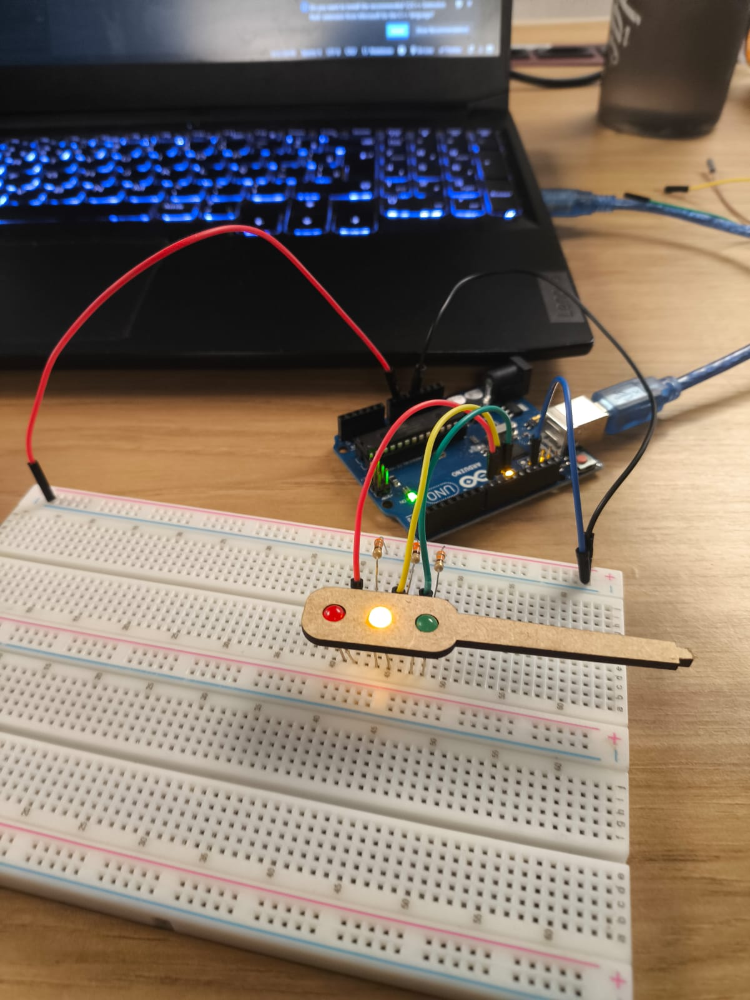
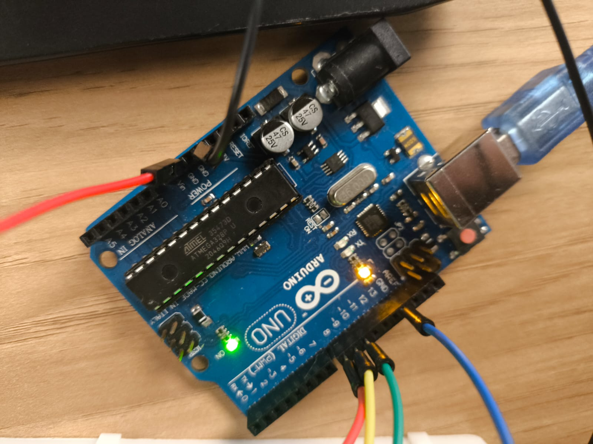
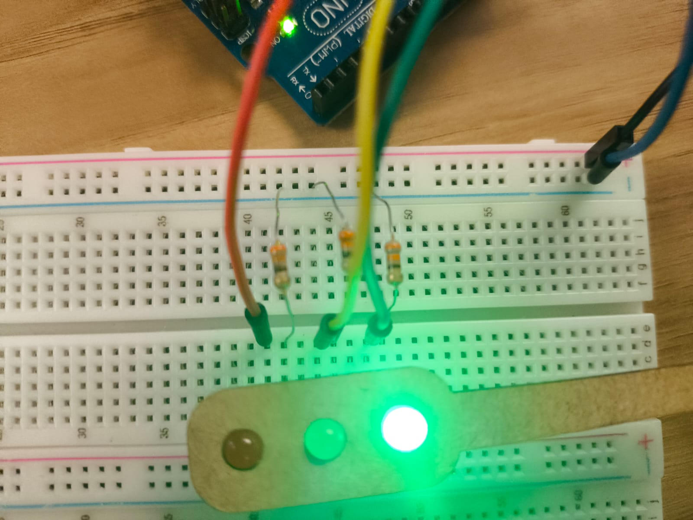

# Semafaro

Projeto de um semáforo usando Arduino 
O semáforo segue esta lógica:

- **Vermelho:** 6 segundos  
- **Verde:** 4 segundos  
- **Amarelo:** 2 segundos  


## 1. Vídeo 

(https://youtube.com/shorts/mcIIk28HDuw?feature=share)


## 2. Materiais Utilizados

- 1x Arduino Uno
- 1x Protoboard
- 3x LEDs (vermelho, amarelo, verde)
- 3x resistores 
- Jumpers macho-macho
- 1x cabo USB


## 3. Esquema e Fotos da Montagem

**Foto do semafaro**  
<br>
<div align="center">
<sub>Figura 1 - Foto do semafaro</sub>
<br>
<br>

<br>
<br>
<sup>Fonte: Material produzido pelos autores (2025)</sup>
</div>
<br>

**Foto 2 - ligacoes do arduino**  
<br>
<div align="center">
<sub>Figura 2 - Foto do arduino </sub>
<br>
<br>

<br>
<br>
<sup>Fonte: Material produzido pelos autores (2025)</sup>
</div>
<br>

**Foto 3 – Conexão na protoboard**  
<br>
<div align="center">
<sub>Figura 3 - Conexoo na protoboard </sub>
<br>
<br>

<br>
<br>
<sup>Fonte: Material produzido pelos autores (2025)</sup>
</div>
<br>

### Processo de montagem 

1. Conectei o Arduino à protoboard.
2. Coloquei os três LEDs na protoboard (ordem: vermelho, amarelo, verde).
3. Liguei o **LED vermelho** ao **pino digital 8** do Arduino, com resistor em série para o GND.
4. Liguei o **LED amarelo** ao **pino digital 9** do Arduino, com resistor em série para o GND.
5. Liguei o **LED verde** ao **pino digital 10** do Arduino, com resistor em série para o GND.
6. Fiz um GND comum na protoboard ligado ao GND do Arduino.
7. Enviei o código para o Arduino e testei os tempos (vermelho 6 s, verde 4 s, amarelo 2 s).


## 4. Código do Semáforo 

```cpp
// tempos em milissegundos
const unsigned long TEMPO_VERMELHO = 6000; // 6 s
const unsigned long TEMPO_VERDE    = 4000; // 4 s
const unsigned long TEMPO_AMARELO  = 2000; // 2 s

const int PINO_VERMELHO = 8;
const int PINO_AMARELO  = 9;
const int PINO_VERDE    = 10;

class Luz {
  int pino;
  unsigned long duracao;
public:
  Luz(int p, unsigned long d) : pino(p), duracao(d) {}
  void begin() {
    pinMode(pino, OUTPUT);
    digitalWrite(pino, LOW);
  }
  void acender() {
    digitalWrite(pino, HIGH);
    delay(duracao);
    digitalWrite(pino, LOW);
  }
};

class Semaforo {
  Luz &vermelho;
  Luz &verde;
  Luz &amarelo;
public:
  Semaforo(Luz &v, Luz &vd, Luz &a)
    : vermelho(v), verde(vd), amarelo(a) {}
  void begin() {
    vermelho.begin();
    verde.begin();
    amarelo.begin();
  }
  void ciclo() {
    vermelho.acender(); // 6 s
    verde.acender();    // 4 s
    amarelo.acender();  // 2 s
  }
};

Luz luzVermelha(PINO_VERMELHO, TEMPO_VERMELHO);
Luz luzVerde(PINO_VERDE, TEMPO_VERDE);
Luz luzAmarela(PINO_AMARELO, TEMPO_AMARELO);
Semaforo semaforo(luzVermelha, luzVerde, luzAmarela);

void setup() {
  semaforo.begin();
}

void loop() {
  semaforo.ciclo();
}

